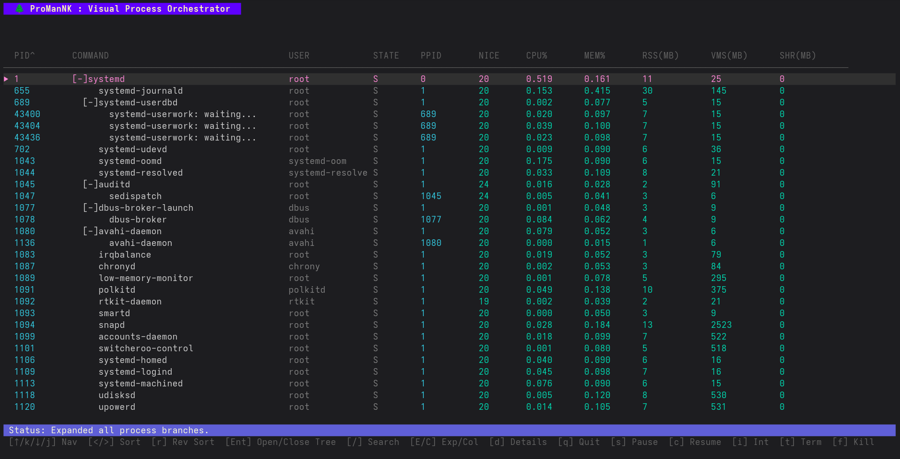
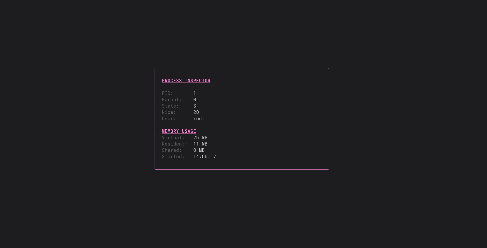

# 🌲 ProManNK: Visual Process Orchestrator

[](https://go.dev/)
[]()
[]()

> A low-level, high-performance Terminal User Interface (TUI) for visualizing and managing operating system workloads as hierarchical process trees.




## 📖 Overview
Unlike standard flat-list utilities such as `top` or `ps`, ProManNK maps out the exact parent-child execution lineage of your system. It allows users to interactively navigate process relationships, monitor real-time resource consumption, and execute granular, system-level POSIX signals directly from the terminal.

Built in Go, it leverages concurrent background polling for zero-lag UI rendering and provides deep insights into the OS process lifecycle.

## ✨ Features
* **Interactive Tree Visualization:** Seamlessly expand and collapse process branches to trace execution from `systemd` (PID 1) downwards.
* **Cascading Operations:** Recursively traverse the process tree to safely terminate or forcefully kill a parent and all of its subsequent children in a single keystroke.
* **Live Fuzzy Search:** Press `/` to instantly filter the active process tree by exact PID or command name.
* **Dynamic Sorting:** Cycle through sort methods (PID, Command, User, CPU%, Mem%) in ascending or descending order while preserving tree structures.
* **Detailed Inspector:** Toggle a dedicated detail panel to view deep metrics on any selected process.
* **Logs Inspector:** Toggle a dedicated view for viewing the latest logs of the selected process.
* **Network Info:** Toggle a dedicated view for fetching networking info about the process.

## 🚀 Installation & Execution

### Prerequisites
* Go 1.20 or higher
* A Linux-based OS (or macOS)

### Installation
You can install ProManNK directly from this repository using `go install`. This will compile the binary and place it in your Go bin directory.

```bash
go install https://github.com/NirbhikKumawat/ProManNK@latest
```
Ensure that your `$GOPATH/bin` (usually `~/go/bin`) is added to your system's `$PATH`.
### Execution
```bash
# Standard execution (Read-only for other users' system processes)
ProManNK

# Elevated execution (Required for full signal control over all processes)
sudo ProManNK
```
## Keybindings
### Navigation and UI
| Key            | 	Action              | 	Description                                       |
|----------------|----------------------|----------------------------------------------------|
| `↑`            | 	Navigate Up         | 	Moves the cursor up the process list.             |
| `↓`            | 	Navigate Down       | 	Moves the cursor down the process list.           |
| `/`            | 	Search              | 	Fuzzy search processes by PID or Command name.    |
| `d`            | 	Toggle Details      | 	Shows/Hides the detailed process inspector panel. |
| `l`            | Toggle Logs          | Shows/Hides the logs                               |
| `n`            | Toggle Network Info  | Shows/Hides Network Info                           |
| `q` / `Ctrl+C` | 	Quit                | 	Safely exits the alternate terminal buffer.       |

### Tree Management
| Key     | 	Action         | 	Description                                           |
|---------|-----------------|--------------------------------------------------------|
| `Enter` | 	Toggle Tree    | 	Expands or collapses the selected process's children. |
| `E`     | 	`Expand All`   | 	Recursively expands all branches in the tree.         |
| `C`     | 	`Collapse All` | 	Collapses the entire tree back to the root nodes.     |

### Process Control (Signals)
| Key	 | Action	          | Description                                              |
|------|------------------|----------------------------------------------------------|
| `i`  | 	Interrupt	      | Sends SIGINT (Ctrl+C equivalent).                        |
| `s`  | 	Pause (Stop)    | 	Sends SIGSTOP to freeze process execution.              |
| `c`  | 	Resume (Cont)   | 	Sends SIGCONT to resume a frozen process.               |
| `t`  | 	Terminate	      | Sends SIGTERM for a graceful shutdown.                   |
| `f`  | 	Force Kill	     | Sends SIGKILL for immediate destruction.                 |
| `T`  | 	Tree Terminate  | 	Recursively sends SIGTERM to the node and all children. |
| `F`  | 	Tree Force Kill | 	Recursively sends SIGKILL to the node and all children. |

### Sorting
| Key       | 	Action       | 	Description                                            |
|-----------|---------------|---------------------------------------------------------|
| `>` / `.` | 	Next Sort    | 	Cycles forward through sort criteria (CPU, Mem, etc.). |
| `<` / `,` | 	Prev Sort    | 	Cycles backward through sort criteria.                 |
| `r` / `R` | 	Reverse Sort | 	Toggles between Ascending and Descending order.        |

## 🛠️ Technical Stack
- __Language__: Go

- __UI Framework__: [Bubbletea](https://github.com/charmbracelet/bubbletea) 

- __Styling__: [Lipgloss](https://github.com/charmbracelet/lipgloss)

- __System Metrics__: [Gopsutil](https://github.com/shirou/gopsutil)
---
Built by [NirbhikTheNice](https://github.com/NirbhikKumawat)